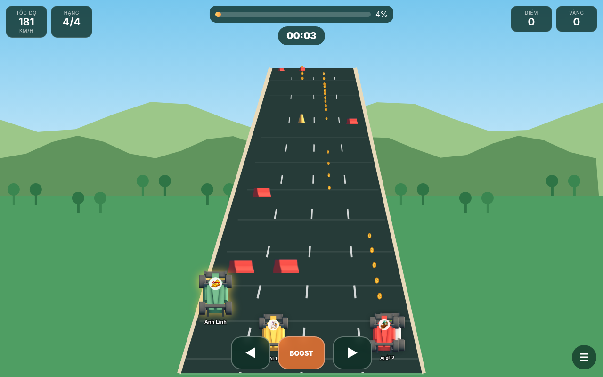

# Lane Clash Racers: Highway Battle

Game đua xe nhiều làn chạy trực tiếp trên trình duyệt, không cần tài khoản người chơi.

> “Đua xe tốc độ cao trên đường cao tốc, nơi mỗi cú chuyển làn vừa để né chướng ngại, vừa để vượt mặt, chặn đường hoặc phản công đối thủ.”



## Chức năng đã có trong bản MVP

- Sảnh hiển thị các phòng đang mở.
- Tạo phòng và mời người chơi bằng đường link `?room=ABC123`.
- 2–8 tay đua; số làn tự động hoặc chỉnh từ 2–8.
- AI tự lấp toàn bộ slot còn trống khi chủ phòng bắt đầu.
- Hai chế độ: Đua về đích và Đua mãi tính điểm.
- Tùy chỉnh thời lượng 60–300 giây, nhập tối đa 1.800 giây hoặc không giới hạn trong Đua mãi.
- Né rào chắn, cọc tiêu và xe giao thông như game chạy vô tận.
- Vàng, điểm, va chạm, bất tử chớp thân xe sau va chạm.
- Power-up tự kích hoạt ngay khi nhặt: Shield, Ghost, Magnet, Mini Turbo, Shockwave và Oil.
- Thanh Perfect Boost chạy qua lại bốn lượt; xếp hạng Perfect, Great, Cool, Bad hoặc Miss.
- Điều khiển bàn phím và nút cảm ứng trên điện thoại.
- 22 avatar động vật do người dùng cung cấp.
- Tài nguyên xe và vật cản từ Kenney Racing Kit CC0.
- Chạy được trên GitHub Pages, không có bước build npm.

## Chạy thử ngay trên máy

Mở thư mục bằng một web server tĩnh. Không nên nhấp trực tiếp `index.html` bằng giao thức `file://`, vì Service Worker và một số tính năng trình duyệt không hoạt động.

Trên Windows có thể nhấp `CHAY_THU_GAME.bat`. Hoặc nếu máy có Python, chạy:

```bash
python -m http.server 8080
```

Sau đó mở `http://localhost:8080`.

Khi chưa cấu hình Supabase, game chạy ở **Demo cục bộ**. Có thể mở hai tab cùng trình duyệt để thử tạo phòng và tham gia bằng link. Hai máy khác nhau chưa nhìn thấy nhau trong chế độ này.

## Bật multiplayer Internet bằng Supabase

1. Tạo một dự án Supabase.
2. Mở SQL Editor và chạy toàn bộ file `SUPABASE_SETUP.sql`.
3. Mở Project Settings > API, lấy Project URL và anon public key.
4. Mở `js/config.js` và thay:

```js
SUPABASE_URL: 'YOUR_SUPABASE_URL',
SUPABASE_ANON_KEY: 'YOUR_SUPABASE_ANON_KEY'
```

5. Tải lại trang. Góc trên bên phải phải hiện `Online · Supabase Realtime`.

## Đưa lên GitHub Pages

1. Tạo repository mới trên GitHub.
2. Tải toàn bộ nội dung trong thư mục này lên nhánh `main`. File `index.html` phải nằm ở thư mục gốc.
3. Vào Settings > Pages.
4. Chọn Deploy from a branch, nhánh `main`, thư mục `/root`.
5. Mở đường link GitHub Pages sau khi triển khai hoàn tất.

Không được đưa `service_role key` vào `config.js`. Chỉ dùng anon public key.

## Cấu trúc chính

- `index.html`: giao diện sảnh, phòng chờ và màn hình game.
- `css/styles.css`: toàn bộ giao diện responsive.
- `js/config.js`: URL và anon key của Supabase.
- `js/network.js`: phòng, người chơi, Realtime Broadcast và chế độ Demo.
- `js/game.js`: vòng lặp game, đường đua, AI, chướng ngại, power-up, Perfect Boost.
- `js/app.js`: điều phối giao diện và luồng tạo/tham gia phòng.
- `SUPABASE_SETUP.sql`: cấu trúc cơ sở dữ liệu và chính sách truy cập.

## Phím điều khiển

- Trái: `←` hoặc `A`.
- Phải: `→` hoặc `D`.
- Bấm Perfect Boost: `Space` hoặc `↑`.
- Điện thoại: dùng ba nút ở cuối màn hình.

## Giới hạn của bản MVP

- Đây là bản nền tảng gameplay, chưa phải hệ thống e-sport chống gian lận.
- Mỗi máy tự mô phỏng xe của mình; trạng thái gửi qua Realtime khoảng 10 lần/giây.
- Chủ phòng mô phỏng AI. Nếu chủ phòng thoát thì phòng bị đóng.
- Chưa có đăng nhập, bảng xếp hạng mùa, âm thanh, cửa hàng xe hoặc lưu thành tích dài hạn.
- Chưa có máy chủ authoritative để xác minh va chạm và kết quả.
- RLS trong file SQL được mở để chơi gia đình không đăng nhập. Trước khi phát hành công khai cần bổ sung xác thực và chính sách bảo mật chặt hơn.

## Ghi chú tài nguyên

Xem `THIRD_PARTY_LICENSES.md`. Avatar động vật là tài nguyên người dùng cung cấp; cần tự xác nhận quyền sử dụng nếu phát hành công khai.
